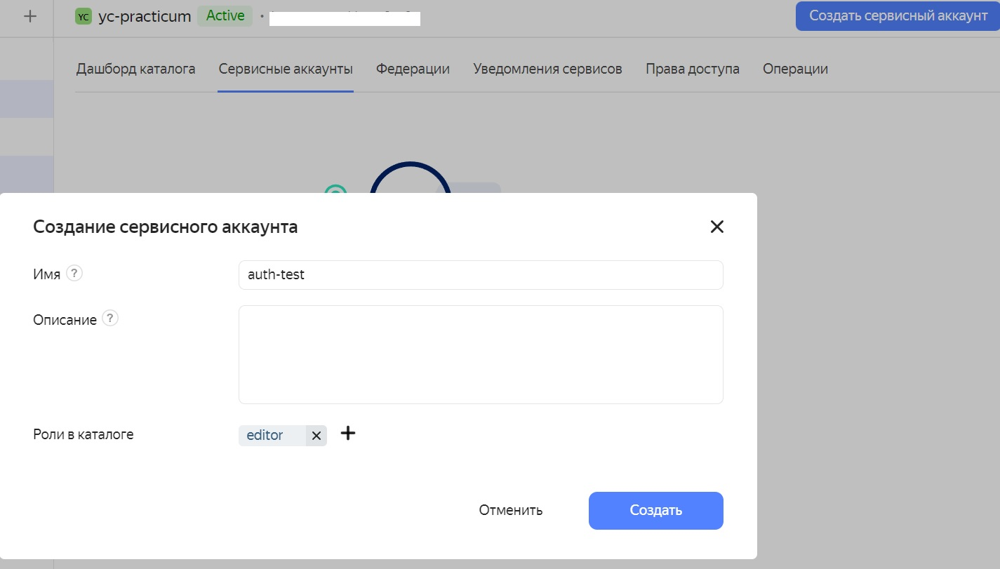
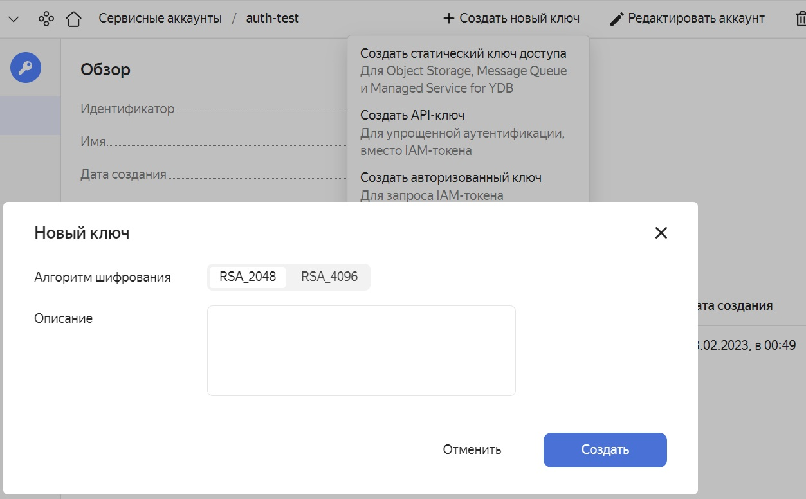

# Yandex.Cloud SDK (C#) Iam JWT Token

Данный пакет является альтернативой OAuth Token или JWT с помощью пакета BouncyCastle __*__  
Ссылка на официальный пакет  [Yandex.Cloud SDK](https://github.com/yandex-cloud/dotnet-sdk).  
Ссылка на сайт с документацией [Получение IAM-токена для сервисного аккаунта](https://cloud.yandex.ru/docs/iam/operations/iam-token/create-for-sa).

__*__ Для `netstandard2.0` по прежнему используется `BouncyCastle`

## Гайд по работе с пакетом
### Установка пакета

```
dotnet add package YandexCloud.IamJwtCredentials
```

### Создание ключей для сервисного аккаунта

1) Перейдите на страницу вашего облака.
2) Создайте сервисный аккаунт.

3) Создайте авторизованный ключ.

4) Скачайте ключ файл `authorized_key.json`.

### Подключение

Укажите путь к файлу `authorized_key.json`

```csharp

IamJwtCredentialsConfiguration configuration = JsonSerializer.Deserialize<IamJwtCredentialsConfiguration>(File.ReadAllText("authorized_key.json"));
var sdk = new Sdk(new IamJwtCredentialsProvider(configuration));

```

### Получение доступа к сервисам

С помощью экземпляра класса `Sdk` можно по `gRPC` получить доступ к сервисам Yandex Cloud.

```csharp
using Yandex.Cloud;

var sdk = new Sdk();
```

## SSL
Так как для аутентификации в `Yandex Cloud` используються криптографические ключи, работа библиотеки зависит от поддержки `SSL`.
Решать проблему с устаревшими системными библиотеками прийдется разработчику с оглядкой на среду, в которой приложение, используещее библиотеку, должно работать

### Linux / Docker
Современная реализация `libssl` проверена начиная с версии рантайма `.NET8.0`  
При референсе `.netstandard2.0` / `netstandard2.1` библиотека обращаеться к `libssl.so.1.1`,
но даже так современный Linux скорее всего настроен на работу с `OpenSSL 3.x`.
Старый OpenSSL 1.1 не понимает некоторые современные параметры и падает.

Заставить OpenSSL 1.1 игнорировать системный файл конфигурации, который предназначен для версии 3.x.
```dotenv
OPENSSL_CONF=/dev/null
```
Ручная привязка библиотек (`libssl.so.1.1`,`libcrypto.so.1.1`)
```dotenv
LD_LIBRARY_PATH:$LD_LIBRARY_PATH:./libs/net2.0/
```
#### Couldn't find a valid ICU package installed
Эта ошибка возникает из-за того, что начиная с .NET 5 и в некоторых сборках .NET Core 3.1,
среда выполнения требует наличия установленных библиотек ICU (International Components for Unicode)
для работы с глобализацией (сортировка строк, парсинг дат и т.д.).
В современных дистрибутивах Linux (особенно минимальных или в Docker) эти библиотеки могут отсутствовать.

Рекомендовано установить пакет ICU  
`sudo yum install libicu`

Включение инвариантного режима (Invariant Mode)  
Если вашему приложению не важны региональные настройки
```dotenv
DOTNET_SYSTEM_GLOBALIZATION_INVARIANT=1
```